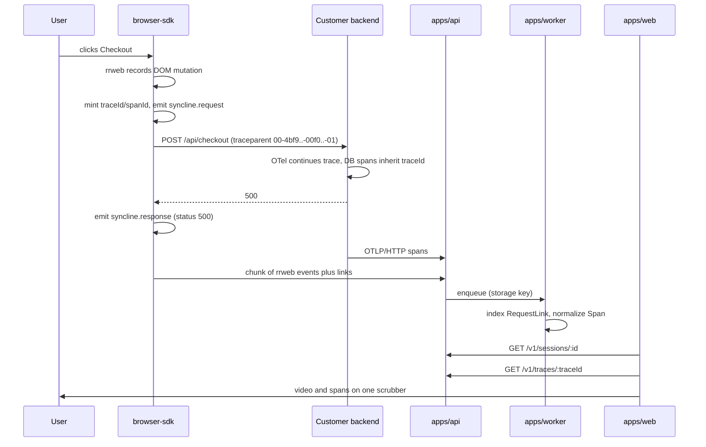

# Syncline Architecture

Status: **design, M0.** This document is the contract that phases 3–8 are built against. Where the
code and this document disagree, one of them is a bug.

---

## 1. What the system does

Given a session ID, Syncline can draw three lanes against a single clock:

1. the DOM replay of what the user saw (rrweb),
2. the backend spans that each of their requests produced (OpenTelemetry),
3. the database calls inside those spans.

The hard part is not storing any one of these. It is knowing that _this_ click produced _that_ span
tree, and drawing them against the same timeline when the two clocks disagree.

## 2. Components

```
apps/api               NestJS. Validates, persists the raw body, enqueues. Never parses payloads.
apps/worker            NestJS standalone. BullMQ consumers: parse, normalize, index.
apps/web               Next.js. The viewer (/s/:id) and the landing page (/).
packages/browser-sdk   Ships to the customer's site. rrweb + fetch/XHR patch.
packages/protocol      Wire types + zod schemas. Shared by SDK, api, worker, web.
packages/models        Prisma schema and generated client.
packages/otlp          OTLP/JSON -> internal Span normalizer.
```

Postgres holds structured data. An object store (MinIO locally, S3-compatible in production) holds
rrweb event blobs. Redis backs BullMQ.

### Why the API does no parsing

Ingest is the only path that must not fall over under load, and the one path whose input is
attacker-controlled. So `apps/api` does four things per request — authenticate the key, check the
size, stream the body to the object store, enqueue a job carrying the storage key — and returns
`202`. Decompression, schema validation, and indexing happen in `apps/worker`, where a slow or
hostile payload costs a queue slot instead of an HTTP connection.

This also keeps BullMQ jobs small. Job payloads are pointers, never megabytes; Redis is a queue,
not a blob store.

---

## 3. The stitching protocol

This is the core of the product. Everything else is plumbing.

### 3.1 The browser mints the trace ID

The SDK patches `fetch` and `XMLHttpRequest`. For requests whose origin is on the project's
allowlist, it generates a W3C [trace context](https://www.w3.org/TR/trace-context/) header:

```
traceparent: 00-4bf92f3577b34da6a3ce929d0e0e4736-00f067aa0ba902b7-01
             ^^ ^-- traceId (16 bytes)          ^-- spanId (8B)  ^^ flags
             version                                              sampled=1
```

`traceId` is 16 random bytes, `spanId` 8, both lowercase hex, both from `crypto.getRandomValues`.

### 3.2 The trace ID is written into the replay stream

At the moment the request fires, the SDK emits an rrweb custom event (`type: 5`):

```ts
// packages/protocol
export const REQUEST_START = 'syncline.request' as const;
export const REQUEST_END = 'syncline.response' as const;

interface RequestStartPayload {
  traceId: string; // 32 lowercase hex
  spanId: string; // 16 lowercase hex
  method: string;
  url: string; // origin + pathname + sanitized search
  startMs: number; // client epoch ms
}

interface RequestEndPayload {
  spanId: string; // correlates back to the start event
  endMs: number;
  status?: number; // absent on network error
  error?: string;
}
```

Two events, not one, because **rrweb's event log is append-only** — the SDK cannot reach back and
stamp a duration onto an event it already emitted. Start and end are separate records correlated by
`spanId`.

The consequence worth the trouble: the trace ID lives _inside_ the recording. Export a session as a
file, hand it to someone else, and it still resolves to its traces. The recording is
self-describing rather than depending on a side table that has to be kept in sync.

The same channel carries everything else that has to sit at a frame rather than beside it:

```ts
export const PAGEVIEW = 'syncline.pageview' as const; // route changes, with what triggered them
export const CONTEXT = 'syncline.context' as const; // identify(), setContext()
export const ERROR = 'syncline.error' as const; // onerror, unhandledrejection
export const CONSOLE = 'syncline.console' as const; // opt-in, per level
```

Each of these is also **denormalized onto the chunk envelope** — `pageviews`, `errors`, `logs`,
`context` beside `links` — for one reason: a worker deciding whether a session broke should not
have to walk a five-thousand-event array to find out. The marker is the record; the copy is the
index.

Console output is the one that stops at a count. Its lines stay in the replay stream and only
`consoleErrorCount`/`consoleWarnCount` are lifted onto the session, because there is far more of it
than there are errors and each line is worth far less.

Context is the one that arrives **late**. A recording starts at page load and who the user is
becomes known after they sign in, several chunks later — so `identify()` and `setContext()` emit
timestamped *changes* rather than writing into the session's opening metadata, and the server
applies the latest value of each key to the whole recording. A session that was anonymous for its
first ten seconds is still findable by the person it turned out to be.

Identity is not a separate mechanism: `identify()` is a context change under the reserved `user`
key. One ordering rule, one way to clear it, one route into the index — rather than a second one
that has to be kept in step.

### 3.3 The backend does nothing Syncline-specific

Standard OpenTelemetry auto-instrumentation reads the incoming `traceparent`, makes the server span
a child of the browser's span, and propagates the same `traceId` to every downstream span,
including the Prisma/pg ones. The customer's integration is:

```sh
OTEL_EXPORTER_OTLP_ENDPOINT=https://syncline.example.com/v1/ingest
OTEL_EXPORTER_OTLP_HEADERS=x-syncline-key=sk_live_...
```

No Syncline backend SDK exists, and none should. Being a plain OTLP sink means Syncline can sit
alongside an existing tracing vendor via a collector fan-out instead of competing with it.

### 3.4 Sampling is inverted

Normally the backend decides what to sample and the frontend finds out later. That produces the
worst possible artifact: a replay of a slow request whose spans were thrown away.

So the _browser_ decides. If a session is being recorded, the SDK sets `sampled=1`, and standard
OTel parent-based sampling honors it. A recorded session always has its spans; an unrecorded one
costs nothing.

### 3.5 Clock skew

Client clocks are wrong — user-set time zones, dead CMOS batteries, VMs that suspended. Skew is
handled for _drawing_ only. It can never affect _attribution_, because attribution is by trace ID.

The SDK calibrates once per session against `GET /v1/clock`:

```
t0     = client.now()   ->   server returns ts = server.now()   ->   t1 = client.now()
rtt    = t1 - t0
offset = ts - (t0 + rtt / 2)          // NTP-style, assumes a symmetric path
```

`offset` and `rtt` are stored on the session. Server timestamps are rendered as
`serverMs - offset`. When `rtt > 100ms` the viewer draws a ±`rtt/2` uncertainty band on the span
lane rather than implying precision it does not have.

### 3.6 End to end



### 3.7 Rules the SDK must not break

- **Never inject `traceparent` cross-origin.** Sending it to a third party leaks internal trace IDs
  and, worse, adds a header their CORS policy does not allow — turning a working request into a
  failed preflight. Injection is allowlist-only, and the allowlist is per project.
- **The customer's own API must allow the header.** Their CORS config needs `traceparent` in
  `Access-Control-Allow-Headers`. This is the single most likely integration failure; it belongs in
  the setup docs and in a future `syncline doctor`.
- **Never let recording break the page.** Every patched call path is wrapped; on any internal error
  the SDK disables itself and falls through to the original `fetch`.

---

## 4. Ingest API

Two keys per project. `pk_*` is public, ships in browser bundles, is write-only and origin-locked.
`sk_*` is secret and server-side. Neither can read.

### `POST /v1/ingest/session/:sessionId/:seq`

```
Content-Type:     application/json
Content-Encoding: gzip
x-syncline-key:   pk_live_...
Origin:           https://app.acme.com     (must match project allowlist)
```

**Why the id and sequence are in the URL.** The storage key is built from them, and reading them
out of the body would mean parsing the payload this endpoint exists not to parse. In the path they
also make object keys meaningful, give the queue a natural job id for deduplication, and appear in
access logs. The body carries them too; the worker checks that the two agree.

```jsonc
{
  "sessionId": "01JQ8Z3K...", // ULID, minted client-side
  "seq": 3, // monotonic; gaps are detectable
  "sdk": { "name": "syncline-browser", "version": "0.1.0" },
  "clock": { "offsetMs": -142, "rttMs": 38 },
  "meta": {
    // seq 0 only
    "url": "https://app.acme.com/checkout",
    "userAgent": "...",
    "viewport": { "w": 1512, "h": 856 },
    "user": { "id": "u_123" },
    "release": "web@2.4.1",
  },
  "events": [/* raw rrweb events, unmodified */],
  "links": [
    // completed requests only
    {
      "traceId": "4bf92f...",
      "spanId": "00f067...",
      "method": "POST",
      "url": "/api/checkout",
      "status": 500,
      "startMs": 1724832000123,
      "endMs": 1724832001901,
    },
  ],
}
```

Responses: `202` accepted · `400` malformed envelope · `401` bad key · `403` origin not allowed ·
`413` too large · `429` rate limited.

**`links` duplicates data that is already inside `events`.** That is deliberate. Without it the
worker would have to decompress and walk the entire rrweb array to find the request events before
it could index anything. The duplication costs a few hundred bytes per chunk and buys O(1)
indexing. A request still in flight at a chunk boundary appears in a later chunk's `links`.

Limits (initial, tunable): 2 MB gzipped per chunk, 5000 events per chunk, 100 chunks per session.

The chunk limit is a validation bound, not a policy. The SDK rotates the session at 90 chunks — a
new id, sequence numbers from zero, metadata sent again — so a session that actually reaches 100 is
a bug rather than a busy page. The gap is headroom: rotating flushes the tail of the outgoing
session, and that chunk needs a sequence number ingest will still accept.

Sessions are also bounded in time: 30 minutes idle ends one, and an absolute ceiling of 60 minutes
rotates it. Either limit alone leaves a hole — time alone lets a busy page exhaust the chunk budget
in minutes, and chunk count alone lets an idle open tab record for a day into one recording.

Transport: flush every 5 s or 64 KB, whichever comes first, and at every page boundary;
`navigator.sendBeacon` on `pagehide`.

### `POST /v1/ingest/traces`

Standard OTLP/HTTP with a JSON payload — `ResourceSpans` as emitted by any OTel SDK or collector.
Auth via `x-syncline-key: sk_*`. Protobuf encoding is a later addition; JSON keeps M2 small.

The route is also served at `/v1/ingest/v1/traces`. An OTel exporter appends `/v1/traces` to
`OTEL_EXPORTER_OTLP_ENDPOINT` but uses `OTEL_EXPORTER_OTLP_TRACES_ENDPOINT` verbatim, so accepting
both means either variable works. The failure it prevents is a 404 swallowed inside a batch
exporter, which surfaces as "no traces" with nothing in the logs.

### `GET /v1/clock`

`{ "serverMs": 1724832000123 }`. No auth, no logging, cache-control `no-store`. Exists solely for
the calibration in §3.5.

---

## 5. Queues

| Queue           | Payload                                     | Worker does                                                                              |
| --------------- | ------------------------------------------- | ---------------------------------------------------------------------------------------- |
| `session-chunk` | `{ projectId, sessionId, seq, storageKey }` | decompress, validate, upsert `Session`, insert `SessionChunk`, bulk-insert `RequestLink` |
| `otlp-traces`   | `{ projectId, storageKey }`                 | normalize `ResourceSpans` to `Span[]`, bulk insert                                       |

Both are idempotent. `SessionChunk` is keyed `(sessionId, seq)` and `Span` is keyed
`(traceId, spanId)`, so a retried job upserts rather than duplicates. BullMQ defaults: 3 attempts,
exponential backoff from 2 s, failed jobs retained for inspection.

Order does not matter. Traces routinely arrive before the session chunk that references them,
because the backend exports on its own schedule. Nothing joins at write time; the join happens at
read time on `traceId`.

---

## 6. Data model

```prisma
model Project {
  id        String   @id @default(cuid())
  name      String
  publicKey String   @unique          // pk_*  browser, write-only
  secretKey String   @unique          // sk_*  server-side
  origins   String[]                  // CORS + traceparent injection allowlist
  createdAt DateTime @default(now())
  sessions  Session[]
}

model Session {
  id            String   @id            // client-minted ULID
  projectId     String
  project       Project  @relation(fields: [projectId], references: [id])
  userId        String?
  release       String?
  userAgent     String?
  url           String?
  viewport      Json?
  clockOffsetMs Int      @default(0)
  rttMs         Int      @default(0)
  startedAt     DateTime
  endedAt       DateTime?
  durationMs    Int?
  meta          Json?
  chunks        SessionChunk[]
  links         RequestLink[]

  @@index([projectId, startedAt(sort: Desc)])   // session list, newest first
}

model SessionChunk {
  id         String   @id @default(cuid())
  sessionId  String
  session    Session  @relation(fields: [sessionId], references: [id], onDelete: Cascade)
  seq        Int
  startedAt  DateTime
  endedAt    DateTime
  eventCount Int
  sizeBytes  Int
  storageKey String                     // sessions/{projectId}/{sessionId}/{seq}.json.gz

  @@unique([sessionId, seq])            // idempotent retries
}

model RequestLink {
  id            String  @id @default(cuid())
  sessionId     String
  session       Session @relation(fields: [sessionId], references: [id], onDelete: Cascade)
  traceId       String
  spanId        String
  method        String
  url           String
  status        Int?
  clientStartMs BigInt
  clientEndMs   BigInt

  @@index([sessionId, clientStartMs])   // draw the network lane in order
  @@index([traceId])                    // reverse lookup: trace -> which replay?
}

model Span {
  traceId      String
  spanId       String
  parentSpanId String?
  name         String
  kind         String
  serviceName  String
  startNs      BigInt
  endNs        BigInt
  durationNs   BigInt
  statusCode   String?
  statusMsg    String?
  attributes   Json                     // db.system, db.statement, http.*, ...

  @@id([traceId, spanId])
  @@index([traceId, startNs])           // fetch a whole trace, already ordered
  @@index([serviceName, startNs])
}
```

The block above is abridged — `packages/models/prisma/schema.prisma` is the authority, and carries
the models the flow, the error lane and the search index added since.

Notes on the shape:

- **rrweb blobs never enter Postgres.** A five-minute session is tens of megabytes of DOM
  mutations. Postgres stores the index; the object store stores the film.
- **Timestamps are `BigInt`.** OTel is nanoseconds since epoch, which overflows `Int`. Millisecond
  fields are `BigInt` too, for consistency at the API boundary.
- **`@@index([traceId])` on `RequestLink` is not for the viewer.** It answers the reverse question —
  "here is a trace ID from an error alert, show me the user's screen when it happened." That is a
  v2 feature, but the index is free now and painful to backfill later.
- **`Span` lives behind an interface**, not accessed via Prisma directly:

```ts
export interface SpanStore {
  insert(spans: Span[]): Promise<void>;
  byTrace(traceId: string): Promise<Span[]>;
  byTraces(traceIds: string[]): Promise<Map<string, Span[]>>;
}
```

Postgres is correct until it isn't. Spans are the one table with unbounded write volume, and
ClickHouse is where it ends up. Confining that to one class now means the migration is a new
implementation plus a config flag rather than a rewrite.

### The search index

Finding a recording is two different questions, and they are stored two different ways.

**"Is this one worth opening"** is a set of counts, and they live as columns on `Session`:
`requestCount`, `failedRequestCount`, `slowestRequestMs`, `errorCount`, the console counts,
`hasBackendSpans`, `serviceNames`, `chunkCount`, `missingChunkSeqs`. A list of fifty recordings has
to cost one query, and "sessions with a request slower than two seconds" must not mean aggregating
every request in the project.

**"Find me the session where X"** is a lookup, and lives in `SessionAttribute` — one narrow
key/value row per fact, indexed on `(projectId, key, value)`:

```
user     u_8823          release  web@2.4.1        host    app.acme.com
path     /checkout       browser  Chrome 131       os      Windows
device   mobile          viewport 1440x900         service checkout-api
accountId acct_412       plan     pro              cartValue 142.50
```

The first nine keys Syncline derives. The rest are whatever the application passed to
`setContext()` — an **open vocabulary**, indexed on arrival, because a key that has to be declared
somewhere before it works means the first attempt always fails silently and the list then lives in
two places that drift. A numeric value is indexed twice, as text and in `numValue`, so
`cartValue:>100` has something to compare: over text it could not, since `'90' > '100'`.

Three kinds of key are refused, and never stored:

- anything matching a credential (`password`, `apiKey`, `authToken`, `sessionId`, …) — refused in
  the browser so it never reaches the network, and again at the worker because an older SDK is
  still a client;
- the nine reserved names above, so an application cannot redefine what `path:` means;
- values that are not a string, number or boolean.

`SessionContext` holds the changes as reported, with the instant of each; `SessionAttribute` holds
only what is currently true. The split is what makes ordering work — chunks arrive out of order and
arrive twice, so latest-wins is computed at read time rather than merged at write time.

A column per filter would need a migration every time someone wanted a new one; searching the
session's JSON would read every recording in the project to answer one lookup. One table answers
all of them at the same cost. `projectId` is denormalized onto the row on purpose — it is the
index's first column, and reaching it through a join would put every project's rows in one scan.

Two properties this depends on:

- **Everything is derived.** `packages/models/src/lib/session-index.ts` is pure functions over rows
  that are still there, so the whole index can be rebuilt from the raw events, links and spans. A
  bug in it is a reindex, not a data loss.
- **Everything is reconciled, not appended.** The worker recomputes a session's summary and
  attributes on every chunk and diffs the result, so a redelivered job writes the same rows and a
  fact the session stopped reporting stops being true of it.

The backend half is written on a different schedule than the rest. `hasBackendSpans` and
`serviceNames` are set when spans arrive, not when the chunk does, because the browser posts its
recording as it goes and the backend exports on its own clock — usually seconds later, sometimes
never. A session asked at chunk time whether its backend was instrumented would answer "no" and
stay wrong.

### Object store layout

```
sessions/{projectId}/{sessionId}/{seq}.json.gz     rrweb events, gzipped JSON array
otlp/{projectId}/{yyyy-mm-dd}/{ulid}.json.gz       raw OTLP bodies, kept for replay and debug
```

---

## 7. Read API

```
GET /v1/sessions?limit&before         one row per recording: counts, flow, why to open it
GET /v1/sessions/:id                  meta, clock, chunk index, links, pageviews, errors
GET /v1/sessions/:id/chunks/:seq      gzipped rrweb events (or a presigned redirect)
GET /v1/traces/:traceId               span tree, timestamps normalized to client ms
```

`GET /v1/sessions` pages by keyset, not offset: `before` is the last id of the previous page, and
session ids are ULIDs so they already sort by creation. An offset would let a recording arriving
mid-scroll shift a page boundary and make a session appear twice or not at all. Every row it
returns is columns on one `Session` row — see the search index above — so the page costs one query
whatever its size.

`GET /v1/traces/:traceId` returns spans already skew-corrected and tree-ordered, so the viewer does
no arithmetic:

```jsonc
{
  "traceId": "4bf92f...",
  "spans": [
    {
      "spanId": "00f067...",
      "parentSpanId": null,
      "depth": 0,
      "name": "POST /api/checkout",
      "serviceName": "api",
      "kind": "SERVER",
      "startClientMs": 1724832000131,
      "endClientMs": 1724832001880,
      "durationMs": 1749,
      "status": "ERROR",
      "attributes": { "http.status_code": 500 },
    },
  ],
}
```

---

## 8. Viewer

Route `/s/[sessionId]`.

```
┌─────────────────────────────────────────┐
│              rrweb player               │
├─────────────────────────────────────────┤
│ Network    ▭▭   ▭    ▭▭▭▭▭   ▭          │  client timings, from RequestLink
│ Backend    │▬▬▬▬▬▬▬│   │▬▬▬│            │  spans, skew-corrected
│ Database   │  ▪▪▪▪ │   │ ▪ │            │  spans where attributes.db.system exists
└──────────▲──────────────────────────────┘
           └ one scrubber drives everything
```

- **The player is the master clock.** Lanes read `replayer.getCurrentTime()` on
  `requestAnimationFrame`; they never hold their own time. One clock, no drift, no reconciliation.
- **Lanes render to `<canvas>`.** A few thousand spans as DOM nodes is a dropped-frame machine.
  Hit-testing is a binary search over start times.
- **Traces load lazily.** `GET /v1/sessions/:id` returns links; span trees are fetched for the
  visible window and cached by `traceId`.

---

## 9. Failure modes

| Situation                           | Behavior                                                                                                                            |
| ----------------------------------- | ----------------------------------------------------------------------------------------------------------------------------------- |
| Customer's CORS omits `traceparent` | Their requests fail preflight. Documented prominently; SDK logs a specific, greppable warning; a future `doctor` command checks it. |
| Third-party origin                  | No header injected, no trace. Request still appears on the network lane from client timings.                                        |
| No backend instrumentation at all   | Network lane renders from client timings alone. Backend and database lanes render an explanatory empty state, not an error.         |
| Traces arrive before the session    | Normal. Joined at read time on `traceId`.                                                                                           |
| Session chunk lost                  | The `seq` gap is detectable; the viewer marks a discontinuity rather than silently playing across it.                               |
| Client clock wildly wrong           | Attribution unaffected (ID-based). Lanes drawn via `offset`; uncertainty band shown when `rtt` is high.                             |
| Backend samples the trace away      | Cannot happen for recorded sessions — see §3.4.                                                                                     |
| Duplicate chunk delivery            | Upsert on `(sessionId, seq)`.                                                                                                       |

---

## 10. Privacy

rrweb records the DOM, which means it records whatever the user is looking at. This is the
project's sharpest edge and the default must be the safe one.

- `maskAllInputs: true` by default. Opting _out_ is the explicit act.
- `.syncline-block` blocks a subtree; `.syncline-mask` masks its text.
- URLs are sanitized before they enter `links` — query values dropped, keys kept.
- Headers and bodies are never captured. Only method, URL, status, and timing.
- OTLP payloads are the customer's own; `db.statement` may contain literals, which is their
  instrumentation's choice to make.

Self-hosted deployment means this data does not leave the operator's infrastructure. That is a
large part of the argument for the project existing.

---

## 11. Out of scope for the MVP

Multi-tenant UI and user auth (one project, one API key, links are unguessable); retention and
garbage collection; session sampling; console-log and network-body capture; mobile SDKs; alerting;
OTLP over protobuf; ClickHouse.

## 12. Open questions

- **Session identity across full page navigations.** `sessionStorage` survives SPA routing but not
  a hard navigation or a new tab. Probably `localStorage` with an idle timeout, but the timeout
  needs a real number behind it.
- **WebSocket and SSE traffic.** There is no `traceparent` equivalent on an open socket. Likely out
  of scope until someone asks.
- **Long sessions.** A 45-minute session is a lot of chunks to fetch before the player can seek.
  Chunk-level lazy loading is probably necessary sooner than expected.
- **Whether `RequestLink` should absorb server-side status.** The client sees `500`; the span knows
  _why_. Denormalizing the span's status onto the link would make the network lane colorable
  without loading trace trees.
